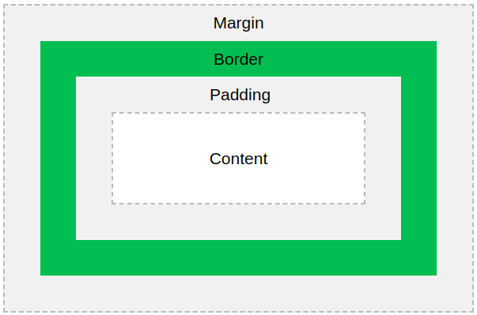

## BOX MODEL
#### PADDING, BORDER, MARGIN
El Box model(modelo de caja CSS) es un cuadro que envuelve todos los elementos HTML.Consiste en márgenes, bordes, relleno y el contenido real.

 
**Content** 
***Contiene el texto y las imágenes***  
**Padding(Relleno)** 
***Borra un área alrededor del contenido. El relleno es transparente***  
**Border** 
***Borde que rodea el padding y el content***  
**Margin** 
***Borra un área fuera del borde. El margen es transparente***  

##### ANCHO TOTAL
Ancho total del elemento = ancho + paddingIzq + paddingDer + borderIzq + borderDer + marginIzq + marginDer

##### ALTURA TOTAL
Altura total del elemento = altura + paddingSuperior + paddingInferior + borderSuperior + borderInferior + marginSuperior + marginInferior

#### BOX SIZING
**SIN box-sizing**

div.relleno1 { 
    width: 300px; 
    height: 100px; 
    border: 1px solid blue; 
}

div.relleno2 { 
    width: 300px; 
    height: 100px; 
    border: 1px solid blue; 
    padding: 50px; 
}

Ambas tienen las mismas propiedades de tamaño, sin embargo, el segundo div al tener un paddind de 50px este termina con una dimensión mayor que el primer div.

**CON box-sizing** 
La propiedad box-sizing permite incluir el relleno y el borde en el ancho y alto total de un elemento. 
***Si se configura box-sizing: border-box al elemento, el relleno y el borde se incluyen en el ancho y la altura***

#### DISPLAY
**display: inline**  
Elementos de línea que ocupan el espacio mínimo necesario horizontal, y permite que otro elemento se coloque a su lado. Por ejemplo: Elementos `<a>`, ``, `<strong>`, ``, `<input>`, `<code>`   
**display: block**
Elementos que ocupan todo el ancho disponible y no permite que otro elemento se posicione a su lado. Por ejemplo, las más usadas: Elementos `
`, `
`,`<h1>`, `<h2>`, `<h3>`, `<ul>`, `<li>`, `<header>`, `<nav>`, `<section>`, `<article>`, `<footer>`, `<form>`, `<table>`  

##### NOTES
`display: flex `  o  ` display: inline `  son casi similares.