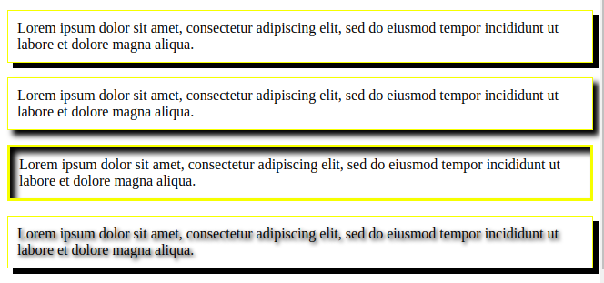

## BORDES
Se puede usar hasta 3 valores para cambiar la apariencia del borde:  

**1. Anchura**  
**2. Color**  

**3. Tipo de borde**  
***none***  
sin borde (por defecto)   
***solid***  
una línea   
***dotted***  
línea de puntos   
***dashed***  
línea discontinua   
***double***  
doble línea   
***groove***  
una línea estriada   
***ridge***  
línea con crestas   
***inset***  
inset global efecto 3D   
***outset***  
outset global efecto 3D   

### TIPOS DE BORDES

### PROPIEDADES DE LOS BORDES
    border-left: ;      borde-izq
    border-right: ;     borde-der
    border-bottom: ;    borde-inferior
    border-top: ;       borde-superior

    border-top-width: ; cambia-grosor
    border-top-color: ; cambia-color

    border-radius: ;    redondea-esquinas

    border-radius: 25px 55px 25px 55px;
    1. Superior izquierda
    2. Superior derecha
    3. Inferior derecha
    4. Inferior izquierda

### BORDES

## SOMBREADO
2 tipos de sombra **sombras de caja** y **sombras de texto**  

### SOMBRAS DE CAJA
**box-shadow** se aplica a todo el bloque y tiene valores:  

    box-shadow: 6px 6px 0px black;

    box-shadow: 6px 6px 6px black;      tono-bajo

    box-shadow: 6px 6px 6px black inset; dentro del bloque

1. offset horizontal de la sombra  
2. offset vertical de la sombra  
3. bajada de tono  
4. color de la sombra  

### SOMBRA DEL TEXTO
**text-shadow** añade sombras a las letras del texto. Los valores trabajan igual que en `box-shadow`.

    text-shadow: 2px 2px 4px black;     sombra del texto

### SOMBRA CAJA Y SOMBRA TEXTO
